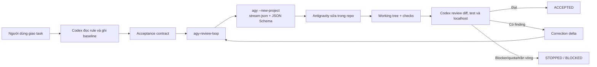
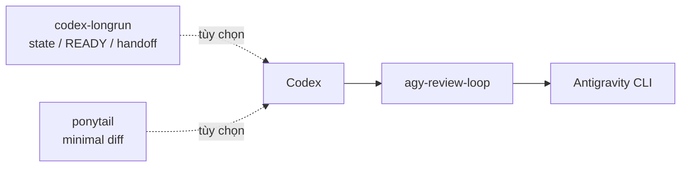

# Codex Antigravity Review Loop

[](https://github.com/tandung060604-prog/codex-antigravity-review-loop/actions/workflows/validate.yml)
[](LICENSE)
[](skills/agy-review-loop/SKILL.md)
[](https://github.com/tandung060604-prog/codex-antigravity-review-loop)

Skill tiếng Việt cho Codex: giao task lập trình không tầm thường cho Google Antigravity CLI (`agy`), sau đó Codex đọc diff thật, chạy kiểm thử độc lập và yêu cầu AGY sửa tiếp trong giới hạn vòng rõ ràng.


> Ảnh trên là minh họa. Mermaid bên dưới là mô tả kỹ thuật chuẩn của workflow.

## Bạn nhận được gì?

```text
Mô tả task → Codex lập acceptance contract → AGY sửa code
           → Codex kiểm tra diff/test → chấp nhận hoặc gửi finding sửa tiếp
```

- AGY là implementation worker; Codex là reviewer độc lập.
- Mỗi vòng có prompt tự chứa, schema JSON và trần quota.
- `DONE` từ AGY chỉ là báo cáo, không phải bằng chứng hoàn thành.
- Thay đổi có sẵn của người dùng được giữ nguyên; không tự reset, clean, commit hay deploy.
- Không cần chạy AGY như một service nền. Codex chỉ gọi khi task phù hợp.

## Tương thích

| Thành phần | Mức hỗ trợ |
| --- | --- |
| Antigravity CLI | 1.1.x; đã smoke test với `1.1.17` |
| Codex | Skill implicit invocation hoặc gọi `$agy-review-loop` |
| Python | 3.10+ để chạy helper và test repo |
| Node.js | Không bắt buộc |
| Git | Bắt buộc cho baseline, diff và scope guard |
| Windows | PowerShell được kiểm tra; macOS/Linux dùng lệnh tương đương |

Kiểm tra phiên bản thực tế của CLI bằng `agy --version`; model và flag có thể thay đổi theo tài khoản hoặc bản phát hành.

## Chu trình hoạt động



`--new-project` là guard quan trọng: project mặc định của AGY có thể giữ workspace cũ dù event `init.cwd` hiển thị đúng. Khi resume conversation đã được xác minh, helper dùng lại project gắn với conversation đó.

## Cài đặt nhanh

### 1. Cài Antigravity CLI và đăng nhập một lần

```powershell
agy --version
agy --prompt-interactive
```

Hoàn tất đăng nhập trong phiên tương tác. Sau đó headless mode dùng credential đã lưu; không cần mở PowerShell mỗi lần bật máy.

### 2. Cấu hình quyền headless

`agy -p` không có hộp thoại để chờ bạn bấm **Allow**. Chỉ cấp trước các lệnh thật sự cần trong `%USERPROFILE%\.gemini\antigravity-cli\settings.json` (Windows) hoặc `~/.gemini/antigravity-cli/settings.json`:

```json
{
  "toolPermission": "request-review",
  "permissions": {
    "allow": [
      "command(git status)",
      "command(git diff)",
      "command(git rev-parse)",
      "command(python -m pytest)"
    ]
  },
  "trustedWorkspaces": [
    "C:/path/to/your/repo"
  ]
}
```

Giữ lại các khóa khác trong file. Không dùng `command(*)` và không bật `--dangerously-skip-permissions` cho workflow thông thường. `accept-edits` chỉ tự duyệt file edit; shell command vẫn chịu permission engine.

Nếu muốn thêm quyền bằng giao diện, mở `agy --prompt-interactive`, nhập `/permissions`, chọn **Project** và thêm rule hẹp. `proceed-in-sandbox` có thể tự chạy lệnh an toàn, nhưng Windows AppContainer có thể yêu cầu nâng quyền cho tool cài bên ngoài sandbox; hãy smoke test trước.

### 3. Cài skill vào Codex

Windows PowerShell:

```powershell
python "$env:USERPROFILE\.codex\skills\.system\skill-installer\scripts\install-skill-from-github.py" `
  --repo tandung060604-prog/codex-antigravity-review-loop `
  --path skills/agy-review-loop
```

macOS/Linux:

```bash
python ~/.codex/skills/.system/skill-installer/scripts/install-skill-from-github.py \
  --repo tandung060604-prog/codex-antigravity-review-loop \
  --path skills/agy-review-loop
```

Khởi động lại Codex nếu skill chưa xuất hiện.

## Cách sử dụng

### Cách mặc định

Chỉ mô tả task trong Codex. Skill có thể tự kích hoạt cho task code đủ lớn:

```text
Trong project hiện tại, sửa lỗi validation của form đăng nhập.

Acceptance criteria:
- tìm root cause trước khi sửa;
- thêm regression test;
- chạy lint và test liên quan;
- giữ nguyên public API;
- không commit, push hoặc deploy.
```

### Ép dùng hoặc bỏ qua

```text
$agy-review-loop
```

```text
Không dùng Antigravity cho task này.
```

Task chỉ đọc, status, lập kế hoạch, sửa rất nhỏ hoặc chỉ sửa tài liệu sẽ được bỏ qua để tiết kiệm quota.

### Ví dụ UI localhost

```text
$agy-review-loop

Trong project localhost hiện tại, thêm motion tinh tế cho các khối giao diện:
- section entrance và scroll reveal;
- stagger cho card/list;
- hover/focus motion nhẹ;
- responsive desktop/mobile;
- hỗ trợ prefers-reduced-motion.

Tái sử dụng stack và dependency hiện có. Không rewrite ứng dụng.
Kiểm tra localhost, console, lint, test và build. Không commit hoặc deploy.
```

Xem prompt hoàn chỉnh trong [frontend-motion.md](examples/frontend-motion.md) và [backend-bugfix.md](examples/backend-bugfix.md).

## Routing và giới hạn vòng

| Class | Ví dụ | Model mặc định | Trần vòng |
| --- | --- | --- | ---: |
| `routine` | sửa cơ học nhỏ | Gemini Flash Medium | 2 |
| `standard` | bug rõ, feature/UI thông thường | Gemini Flash Medium | 3 |
| `complex` | bug khó, refactor nhiều file | Gemini Flash High | 4 |
| `critical` | auth, payment, security, data integrity | Gemini Flash High | 5 |

Gemini Pro chỉ dùng sau khi đã chẩn đoán blocker và người dùng xác nhận. Kiểm tra model/quota bằng `agy models`, `/usage` và `/credits`.

Skill không chạy loop vô hạn. Codex dừng khi đạt acceptance, hết trần vòng, gặp hai vòng không tiến triển, hoặc cần quyền mới.

## Longrun và Ponytail có bắt buộc không?

Không. Repo này chỉ đóng gói `agy-review-loop`.



| Lớp | Bắt buộc? | Trách nhiệm |
| --- | --- | --- |
| `agy-review-loop` | Có | Giao AGY, review diff, kiểm thử và bounded correction |
| `codex-longrun` | Không | State dài hạn, task `READY`, checkpoint và handoff |
| `ponytail` | Không | Chọn giải pháp nhỏ nhất, tránh abstraction/dependency thừa |

Với dự án nhiều phiên, thứ tự nên là:

```text
codex-longrun → Ponytail → agy-review-loop → Antigravity CLI
```

Mỗi lớp chỉ giữ một trách nhiệm. Xem [integrations.md](skills/agy-review-loop/references/integrations.md) trước khi kết hợp.

## Quyền, dữ liệu và chi phí

### Quyền

- Headless mode không thể tự bấm hộp xác nhận; hãy dùng allowlist hoặc `/permissions` theo project.
- Không tự động hóa việc bấm **Allow** bằng AutoHotkey/GUI script; dễ cấp nhầm quyền và không ổn định.
- Không dùng `--dangerously-skip-permissions` trừ khi người dùng chủ động phê duyệt cho một repo cô lập.
- Quyền, credential, thay đổi billing, deploy production và xóa hàng loạt luôn là blocker cần hỏi người dùng.

### Dữ liệu

- Prompt không được lưu vào summary.
- Raw AGY event tắt mặc định vì có thể chứa nội dung file/tool payload.
- Không đưa secret, PII, dataset thật hoặc log production chưa lọc vào prompt/repo public.
- `.agy-review/` chỉ lưu metadata, usage, trạng thái protocol và structured output cần thiết.

### Chi phí

- Dùng `routine`/`standard` cho task nhỏ; không mặc định chạy tới 5 vòng.
- Chạy test mục tiêu trước full suite.
- Giữ correction delta ngắn và không lặp lại toàn bộ lịch sử.
- Dừng sau hai vòng không tiến triển.
- Token Codex và quota AGY là hai đồng hồ khác nhau; không hứa một mức credit cố định.

Xem [chi phí và rủi ro](docs/chi-phi-va-rui-ro.md) và [vận hành hằng ngày](docs/van-hanh-hang-ngay.md).

## Khi AGY bị chặn

| Dấu hiệu | Nguyên nhân thường gặp | Cách xử lý |
| --- | --- | --- |
| `PERMISSION_BLOCKED` | Headless gặp permission `Ask` | Thêm allow rule hẹp, không đổi model |
| File bị tìm ở workspace cũ | Default project của AGY bị giữ lại | Để helper dùng `--new-project` |
| `AUTH_REQUIRED` | Credential hết hạn hoặc chưa đăng nhập | Chạy `agy --prompt-interactive` một lần |
| `TIMEOUT` | AGY không trả result trong thời gian bị giới hạn | Đọc summary, kiểm tra permission/prompt/worktree; chỉ retry khi đã có nguyên nhân cụ thể |
| Sandbox yêu cầu nâng quyền Windows | AppContainer không chạy được executable ngoài sandbox | Tắt sandbox cho round đó và dùng allowlist command cụ thể |
| Structured output không hợp lệ | AGY chưa trả schema bắt buộc | Codex phân loại protocol, review nguyên nhân, không chấp nhận `DONE` mù quáng |

Helper ghi lỗi runtime rõ ràng trong `.agy-review/<task-id>/summary.json`; lỗi quyền là `PERMISSION_BLOCKED` và protocol là `NOT_REACHED`, không bị gắn nhầm thành lỗi schema.

## Chạy helper thủ công

```powershell
python skills\agy-review-loop\scripts\agy_round.py `
  --repo C:\path\to\repo `
  --task-id AUTH-142 `
  --round 1 `
  --class standard `
  --prompt-file C:\path\to\prompt.txt
```

Helper tự thêm `--new-project` cho fresh round, gọi `stream-json` + JSON Schema và lưu summary tại `.agy-review/AUTH-142/`. Mặc định AGY có 5 phút và host watchdog thêm 30 giây; heartbeat 30 giây báo round còn sống. Chỉ truyền `--conversation <id>` khi ID đó đã xuất hiện trong summary của chính task.

Không bật `--save-events` trừ khi cần audit; raw JSONL có thể chứa dữ liệu nhạy cảm.

## Cấu trúc repo

```text
skills/agy-review-loop/
  SKILL.md                    hướng dẫn vận hành Codex
  scripts/agy_round.py        chạy một round AGY có cấu trúc
  assets/                     JSON Schema và routing policy
  references/                 tích hợp, chi phí, prompt và vận hành
  agents/openai.yaml          metadata cho implicit invocation
docs/
  architecture.md             trách nhiệm và state model
  v0.2-structured-protocol.md protocol/metrics
  chi-phi-va-rui-ro.md        chi phí và rủi ro
  van-hanh-hang-ngay.md       prompt đối chiếu hằng ngày
examples/                     prompt UI/backend mẫu
tests/                        regression cho protocol và cấu trúc
```

## Phát triển và đóng góp

```powershell
git clone https://github.com/tandung060604-prog/codex-antigravity-review-loop.git
cd codex-antigravity-review-loop
python scripts/validate_repo.py
python -m unittest discover -s tests -p "test_*.py"
python "$env:USERPROFILE\.codex\skills\.system\skill-creator\scripts\quick_validate.py" skills/agy-review-loop
```

Trước khi mở pull request, đọc [CONTRIBUTING.md](CONTRIBUTING.md). Không commit credential, dữ liệu cá nhân, raw logs hoặc thay đổi ngoài phạm vi.

## Tài liệu chính

- [SKILL.md](skills/agy-review-loop/SKILL.md) — hợp đồng vận hành đầy đủ.
- [Structured protocol](docs/v0.2-structured-protocol.md) — schema, summary và routing.
- [Architecture](docs/architecture.md) — trách nhiệm giữa Codex, Longrun, Ponytail và AGY.
- [Integrations](skills/agy-review-loop/references/integrations.md) — cách kết hợp workflow.
- [Daily operations](docs/van-hanh-hang-ngay.md) — đối chiếu đầu/cuối ngày.
- [Cost and risk](docs/chi-phi-va-rui-ro.md) — tối ưu quota và giới hạn an toàn.
- [Antigravity headless mode](https://antigravity.google/docs/cli/headless/) — tài liệu chính thức của AGY.
- [Antigravity permissions](https://antigravity.google/docs/cli/permissions) — allow/deny/ask và scope.

## License

Apache License 2.0. Bạn có thể sử dụng, sửa đổi, tích hợp và thương mại hóa theo license. Xem [NOTICE](NOTICE) về attribution và thương hiệu.
