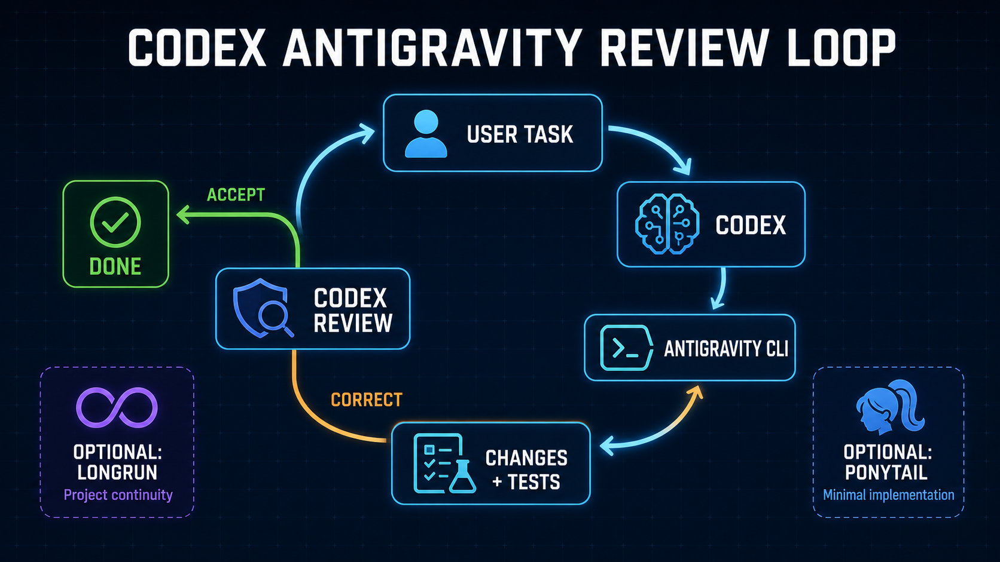
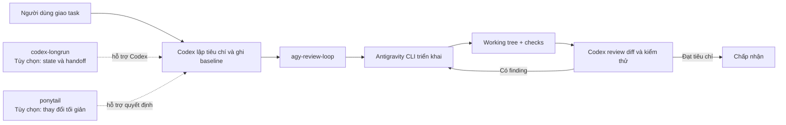

# Codex Antigravity Review Loop

[](https://github.com/tandung060604-prog/codex-antigravity-review-loop/actions/workflows/validate.yml)
[](LICENSE)
[](https://github.com/tandung060604-prog/codex-antigravity-review-loop)

Skill cho Codex để giao một task lập trình cho Google Antigravity CLI (`agy`), kiểm tra thay đổi thật trong repo, chạy validation và yêu cầu sửa tiếp trong số vòng có giới hạn.



> Ảnh trên là minh họa AI. Sơ đồ Mermaid bên dưới là mô tả kỹ thuật chính xác.

## TL;DR

- Cần có: **Codex**, **Git**, **Python**, **Antigravity CLI** và skill `agy-review-loop` trong repo này.
- Không bắt buộc: `codex-longrun` và `ponytail`; hai công cụ này **không được bundle trong repo**.
- Người mới nên chạy workflow lõi trước. Chỉ thêm Longrun khi dự án kéo dài nhiều phiên; chỉ thêm Ponytail khi muốn ép thay đổi tối giản.
- Codex có thể tự chọn skill cho task code đủ lớn. Gọi `$agy-review-loop` nếu muốn ép sử dụng; nói `Không dùng Antigravity cho task này` nếu muốn bỏ qua.
- Antigravity báo `DONE` chưa có nghĩa là hoàn thành: Codex vẫn phải đọc diff và chạy check thật.

## Hệ thống hoạt động như thế nào?



Luồng bắt buộc là:

```text
Yêu cầu → Codex → agy-review-loop → Antigravity CLI → thay đổi trong repo
          ↑                                      ↓
          └──────── review diff + test ──────────┘
```

`codex-longrun` và `ponytail` là hai lớp hỗ trợ quanh Codex, không phải hai bước Antigravity bắt buộc phải chạy.

## Repo có sẵn Longrun và Ponytail không?

Không. Repo chỉ đóng gói `agy-review-loop`.

| Thành phần | Bắt buộc? | Có trong repo? | Dùng khi nào |
| --- | --- | --- | --- |
| `agy-review-loop` | Có | Có | Điều phối AGY, review và lặp sửa có giới hạn |
| Antigravity CLI | Có | Không | Agent triển khai bên ngoài Codex |
| `codex-longrun` | Không | Không | Dự án nhiều phiên, cần `READY` task, checkpoint và handoff |
| [`ponytail`](https://github.com/DietrichGebert/ponytail) | Không | Không | Muốn ưu tiên giải pháp nhỏ nhất, tránh dependency và abstraction thừa |

`codex-longrun` hiện là skill riêng trong môi trường của maintainer nhưng repo này chưa cung cấp nguồn cài public cho nó. Người dùng mới nên bỏ qua cho đến khi có một bản phát hành và đường dẫn cài độc lập.

Khuyến nghị:

- **Người mới hoặc task nhỏ–vừa:** chỉ dùng `agy-review-loop`.
- **Dự án kéo dài nhiều ngày hoặc dễ mất context:** thêm một skill tương thích `codex-longrun`.
- **Repo có xu hướng over-engineering:** thêm Ponytail.
- **Dự án dài và phức tạp:** có thể dùng cả ba, nhưng từng lớp vẫn giữ đúng một trách nhiệm.

## Bắt đầu nhanh

### 1. Kiểm tra Antigravity CLI

```powershell
agy --version
agy -p "Reply with exactly AGY_OK. Do not edit files or run commands." --output-format text
```

Nếu `agy` chưa chạy hoặc chưa đăng nhập, hãy hoàn tất bước đó trước khi cài skill.

### 2. Cài skill từ GitHub

Windows PowerShell:

```powershell
python "$env:USERPROFILE\.codex\skills\.system\skill-installer\scripts\install-skill-from-github.py" `
  --repo tandung060604-prog/codex-antigravity-review-loop `
  --path skills/agy-review-loop
```

macOS/Linux:

```bash
python ~/.codex/skills/.system/skill-installer/scripts/install-skill-from-github.py \
  --repo tandung060604-prog/codex-antigravity-review-loop \
  --path skills/agy-review-loop
```

Khởi động lại Codex nếu skill chưa xuất hiện.

### 3. Giao task bình thường

Không cần mở terminal hoặc tự chạy `agy`:

```text
Trong project hiện tại, sửa lỗi validation của form đăng nhập.

Tiêu chí hoàn thành:
- tìm root cause trước khi sửa;
- thêm regression test;
- chạy lint và test liên quan;
- giữ nguyên public API;
- không commit, push hoặc deploy.
```

Codex có thể tự kích hoạt skill cho task code đủ lớn và sẽ báo trước khi gọi Antigravity. Skill bỏ qua câu hỏi chỉ đọc, status/kế hoạch, sửa rất nhỏ và thay đổi chỉ có tài liệu để tiết kiệm quota.

Điều khiển thủ công khi cần:

```text
$agy-review-loop                         # ép dùng skill
Không dùng Antigravity cho task này.     # bỏ qua trong task hiện tại
Giới hạn tối đa 2 vòng AGY.              # giảm quota
```

## Ví dụ UI localhost

```text
Trong project localhost hiện tại, thêm motion tinh tế cho các khối giao diện:
- section entrance và scroll reveal;
- stagger cho card/list;
- hover/focus motion nhẹ;
- responsive desktop/mobile;
- hỗ trợ prefers-reduced-motion.

Tái sử dụng stack và dependency hiện có. Không rewrite ứng dụng.
Kiểm tra localhost, console, lint, test và build. Không commit hoặc deploy.
```

Xem thêm [frontend motion](examples/frontend-motion.md) và [backend bug fix](examples/backend-bugfix.md).

## Codex làm gì sau mỗi vòng AGY?

1. Ghi trạng thái Git ban đầu và giữ nguyên thay đổi có sẵn của người dùng.
2. Chuyển yêu cầu thành tiêu chí có thể kiểm tra.
3. Giao đúng một vòng có structured output cho Antigravity.
4. Xem báo cáo AGY như một claim, rồi tự đọc diff và chạy check thật.
5. Nếu có lỗi, gửi finding ngắn kèm file và bằng chứng để AGY sửa.
6. Chấp nhận khi mọi tiêu chí đạt; dừng khi hết trần vòng, không tiến triển hoặc cần quyền mới.

Trần mặc định theo độ khó:

| Class | Ví dụ | AGY mặc định | Trần vòng |
| --- | --- | --- | ---: |
| Routine | sửa cơ học nhỏ | Gemini Flash Medium | 2 |
| Standard | bug rõ, feature/UI thông thường | Gemini Flash Medium | 3 |
| Complex | bug khó, refactor nhiều file | Gemini Flash High | 4 |
| Critical | auth, payment, security, data integrity | Gemini Flash High | 5 |

Gemini Pro chỉ được dùng sau khi chẩn đoán blocker và người dùng xác nhận. Model và quota thực tế phụ thuộc phiên bản CLI cùng tài khoản; kiểm tra bằng `agy models`, `/usage` và `/credits`.

## Dùng riêng hay kết hợp?

### Workflow mặc định — phù hợp với đa số người dùng

```text
Codex → agy-review-loop → Antigravity CLI
```

Không cần cài thêm gì ngoài các thành phần bắt buộc.

### Thêm Ponytail — khi muốn code tối giản

```text
Ponytail policy → Codex → agy-review-loop → Antigravity CLI
```

Ponytail định hướng cách chọn giải pháp; `agy-review-loop` vẫn chịu trách nhiệm giao việc, review và dừng vòng lặp.

### Thêm Longrun — khi dự án qua nhiều phiên

```text
Longrun state/READY task → Codex → agy-review-loop → Antigravity CLI
```

Longrun giữ project state và handoff. Antigravity không nên tự sửa các file state nếu task không sở hữu chúng.

Xem [hướng dẫn tích hợp](skills/agy-review-loop/references/integrations.md) trước khi dùng cả ba lớp.

## Dữ liệu, quota và rủi ro

Helper lưu summary gọn tại `.agy-review/<task-id>/`. Prompt không được lưu; raw JSONL mặc định tắt vì tool event có thể chứa dữ liệu nhạy cảm.

| Rủi ro | Cách kiểm soát |
| --- | --- |
| AGY báo xong nhưng code chưa đạt | Codex đọc diff và chạy check độc lập |
| Tiêu quota do lặp | trần vòng động; dừng sau hai vòng không tiến triển |
| Ghi đè việc đang làm | ghi baseline; không tự reset, checkout hoặc clean |
| Lộ secret trong log | không lưu prompt; raw event tắt mặc định |
| Tự ý commit/deploy/mua credit | bị chặn mặc định và cần quyền riêng |
| UI build qua nhưng hiển thị lỗi | yêu cầu kiểm tra localhost và console |

Skill không chạy nền, không tự mua AI credits và không vượt quyền truy cập. Xem [chi phí và rủi ro](docs/chi-phi-va-rui-ro.md) cùng [vận hành hằng ngày](docs/van-hanh-hang-ngay.md).

## Cấu trúc repo

```text
skills/agy-review-loop/       skill cài vào Codex
  agents/openai.yaml          metadata và implicit invocation
  scripts/agy_round.py        chạy một vòng AGY có cấu trúc
  assets/                     JSON Schema và routing policy
  references/                 protocol, tích hợp, chi phí, vận hành
docs/                         tài liệu chuyên sâu
examples/                     prompt và profile mẫu
scripts/                      validator và daily snapshot
tests/                        kiểm tra protocol và cấu trúc
```

## Phát triển và đóng góp

```powershell
git clone https://github.com/tandung060604-prog/codex-antigravity-review-loop.git
cd codex-antigravity-review-loop
python scripts/validate_repo.py
python -m unittest discover -s tests -p "test_*.py"
python "$env:USERPROFILE\.codex\skills\.system\skill-creator\scripts\quick_validate.py" skills/agy-review-loop
```

Tài liệu liên quan:

- [Structured protocol và model routing](docs/v0.2-structured-protocol.md)
- [Kiến trúc](docs/architecture.md)
- [Vận hành hằng ngày](docs/van-hanh-hang-ngay.md)
- [Chi phí và rủi ro](docs/chi-phi-va-rui-ro.md)
- [Hướng dẫn đóng góp](CONTRIBUTING.md)

## License

Apache License 2.0. Bạn có thể sử dụng, sửa đổi, tích hợp và cung cấp dịch vụ thương mại theo license. Xem [NOTICE](NOTICE) về attribution và thương hiệu.
